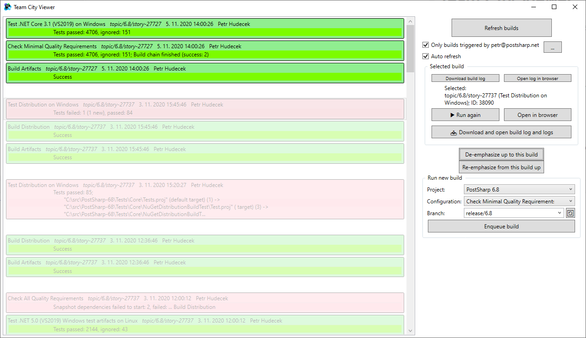

# Team City Viewer
TeamCity Viewer is a Windows application that acts as a faster and better front-end to TeamCity build servers.

Features:
* Show recent builds, including queued builds
* Immediately download logs from them, or rebuild them
* Run new builds in any project
* Filter only builds that you created

How to use:
* In SavedConfig.cs, change the HostName to the hostname of your TeamCity server.
* Build and run.
* In TeamCity, create an access token.
* In the UI, change the used access token with a button.

Screenshot:
